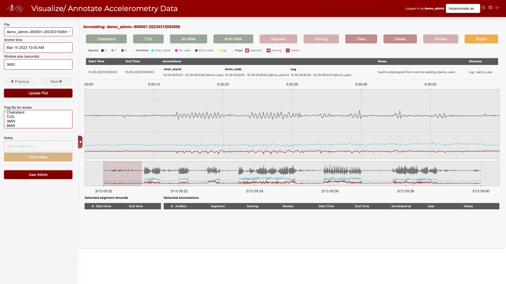

# Accelerometry Annotation Tool

[](https://pypi.org/project/accelerometry-annotator/)
[](https://opensource.org/licenses/MIT)
[](https://tavoloperuno-accelerometry-viewer-demo.hf.space/)
[](https://tavoloperuno.github.io/py_visualize_accelerometry/)
[](https://www.python.org/downloads/)
[](https://doi.org/10.5281/zenodo.19023756)

A web app for viewing and annotating tri-axial accelerometry data. Research teams use it to label activity segments in long recordings together. Built with [Panel](https://panel.holoviz.org/) and [Bokeh](https://bokeh.org/). Sensor-agnostic: any HDF5 file with `timestamp`, `x`, `y`, `z` columns works.



## Live Demo

A publicly accessible demo is hosted on Hugging Face Spaces:

**[Launch Demo](https://tavoloperuno-accelerometry-viewer-demo.hf.space/)**

| Username | Password | Role |
|---|---|---|
| `demo_admin` | `demo` | Admin (can manage users, impersonate) |
| `demo_user` | `demo` | Annotator |

> **Note:** The demo uses real accelerometer data from the dataset below,
> resampled and composed into short recordings (~10 min at 85 Hz). It does
> not contain real participant data. Example annotations are pre-populated
> to show labeling, flags, and inter-annotator variability.
>
> AlSahly, A. (2022). *Accelerometer Gyro Mobile Phone Dataset* [Dataset]. UCI Machine Learning Repository. https://doi.org/10.3390/s22176513

## Shared Server Deployment (HPC / Slurm)

On HPC, one Slurm job hosts the app for the whole team. Each member connects through an SSH tunnel.

Connect (submits a job automatically if one isn't running):
```bash
bash hpc_utils/connect.sh
```

Stop the server:
```bash
bash hpc_utils/stop_server.sh
```

## What it does

Researchers collect tri-axial accelerometry signals and need to mark where specific activities happen in long recordings. This tool lets annotators inspect the signal, box-select a time range, and label it.

The built-in labels target four physical performance tests, but the app loads any HDF5 file with the right schema.

- **Chair Stand Test.** Five sit-to-stand cycles. Measures lower-extremity strength.
- **Timed Up and Go (TUG).** Rise, walk 3 m, turn, walk back, sit. Measures functional mobility.
- **3-Meter Walk Test.** Short-distance gait speed.
- **6-Minute Walk Test.** Submaximal endurance.

## Features

- **LTTB downsampling.** Renders 500K+ points smoothly by reducing each axis to ~10,000 visually representative points (Largest Triangle Three Buckets).
- **Server-side HDF5 filtering.** Loads only the visible time window via PyTables `where` clauses. Under 20 ms on 1 GB+ files.
- **Fast navigation.** Previous/Next patches the plot data in place; no full figure rebuild.
- **Network latency indicator.** Header shows live round-trip latency to the server, color-coded by speed.
- **Range selector.** Minimap to navigate long recordings without losing context.
- **Box-select annotation.** Drag a time range, click an activity button.
- **Segment, scoring, and review flags.** Three hatch patterns on top of the activity overlay.
- **Vector magnitude overlay.** Toggle a fourth trace (√(x²+y²+z²)). Orientation-independent, so periodic motion and impacts pop out.
- **Walking detection (Urbanek 2015).** FFT-based scan for sustained harmonic walking. Candidates show as dashed orange overlays, persist across refresh in a shared xlsx, and can be dismissed or reinstated per segment. No ML — classical signal processing.
- **Notes.** Free text attached to any annotation.
- **Multi-user collaboration.** Each annotator sees their own file assignments. Admins can impersonate users and manage accounts.
- **Authentication.** Basic auth out of the box; OAuth for production.
- **Excel export.** One annotation file per user.

## Installation

### Prerequisites

- Python 3.9+
- Conda (recommended) or pip

### Setup

```bash
# Clone the repository
git clone git@github.com:TavoloPerUno/py_visualize_accelerometry.git
cd py_visualize_accelerometry

# Create and activate conda environment
conda create -n panel_app python=3.12
conda activate panel_app

# Install dependencies
pip install -r requirements.txt
```

### Data setup

Place HDF5 accelerometry files (`.h5`) in:
```
visualize_accelerometry/data/readings/
```

Each file should contain a `readings` table with columns: `timestamp`, `x`, `y`, `z`.

### Credentials

Create a `credentials.json` file in the project root:
```json
{
    "username1": "password1",
    "username2": "password2"
}
```

See `credentials.json.example` for reference.

## Running the app

### Local development

```bash
panel serve visualize_accelerometry/app.py \
    --port 5601 \
    --basic-auth credentials.json \
    --cookie-secret $(python -c "import secrets; print(secrets.token_hex(32))") \
    --allow-websocket-origin localhost:5601 \
    --basic-login-template visualize_accelerometry/templates/login.html
```

Then open http://localhost:5601/app in your browser.

### HPC (SLURM)

See [Shared server startup](docs/shared-server-startup.md) for the self-service shared server workflow, or [Slurm deployment guide](docs/slurm-deployment.md) for the full deployment guide.

## Project structure

```
py_visualize_accelerometry/
├── visualize_accelerometry/
│   ├── app.py                  # Main Panel application and layout
│   ├── callbacks.py            # UI event handlers and annotation logic
│   ├── config.py               # Colors, paths, user lists, constants
│   ├── data_loading.py         # HDF5 I/O, annotation and walking-suggestion file management
│   ├── plotting.py             # Bokeh plots with LTTB downsampling and VM overlay
│   ├── state.py                # Per-session state management
│   ├── walking_detection.py    # Urbanek 2015 sustained-harmonic-walking detector
│   ├── templates/              # Login/logout HTML templates
│   ├── static/                 # Favicon, logo
│   └── data/
│       ├── readings/           # HDF5 accelerometry files
│       └── output/             # Per-user annotation Excel files + shared walking_suggestions.xlsx
├── hpc_utils/                  # HPC deployment scripts (Slurm, SSH tunneling)
│   ├── connect.sh              # Self-service connect script
│   ├── start_server.sh         # Slurm job script
│   ├── stop_server.sh          # Stop running server
│   └── logs/                   # Job and server logs
├── requirements.txt
└── credentials.json            # Auth credentials (not in repo)
```

## Documentation

Full documentation is available at [https://tavoloperuno.github.io/py_visualize_accelerometry/](https://tavoloperuno.github.io/py_visualize_accelerometry/).

To build documentation locally:

```bash
pip install sphinx furo sphinx-copybutton myst-parser
cd docs
make html
open _build/html/index.html
```

## Versioning and releases

This project uses [Semantic Versioning](https://semver.org/). The canonical version lives in `visualize_accelerometry/__init__.py` as `__version__`.

### Cutting a release

1. Update `__version__` in `visualize_accelerometry/__init__.py`
2. Update `CHANGELOG.md` with the new version's changes
3. Commit the changes:
   ```bash
   git add visualize_accelerometry/__init__.py CHANGELOG.md
   git commit -m "release: v<VERSION>"
   ```
4. Create and push the tag:
   ```bash
   git tag v<VERSION>
   git push origin v<VERSION>
   ```
5. The `release.yml` GitHub Actions workflow will automatically create a GitHub Release with auto-generated notes from commits since the last tag.

## License

MIT License. This project is developed by the [National Social Life, Health, and Aging Project (NSHAP)](https://www.norc.org/research/projects/national-social-life-health-and-aging-project.html) lab at the University of Chicago.
