# Annotation Guide

This guide is the annotator-facing reference for marking up accelerometry recordings of the NSHAP Round 4 physical-function tests: Chair Stand, 3-Meter Usual Walk, Timed Up and Go (TUG), and the 6-Minute Walk Test (6MWT). It covers what to look for in the signal, where to start and stop each annotation, and how to handle common edge cases.

## Definitions

| Term | Meaning |
|---|---|
| **Annotation** | A time range marked on the recording, with one or more labels applied to it. |
| **Episode** | The full duration of one performance-test attempt, including warm-up, false starts, and recovery. |
| **Score** | The clean section of the episode used to time the participant. |
| **Segment** | An individual repetition or sub-section within an episode (e.g. one of the five sit-to-stand cycles). |
| **Dominant stride** | A stride from the leg on the same side as the accelerometer. |
| **Non-dominant stride** | A stride from the opposite leg. |

## How the app's labels map to Episode / Score / Segment

The app stores every annotation as a time range plus an *artifact* label (the test type) and up to three *flags* (segment, scoring, review). The three annotation types from the NSHAP guide map onto this as follows:

| NSHAP guide term | What you do in the app |
|---|---|
| Episode | Box-select the range, click the test button (`Chairstand`, `TUG`, `3m Walk`, `6min Walk`). No flag is needed. |
| Score | On a fresh annotation of the same range, click the test button, then click **Scoring**. |
| Segment | On a fresh annotation of the sub-range, click the test button, then click **Segment**. |
| Flag for review | Click **Review** on any annotation that needs a second pair of eyes. Add a note explaining why. |

Flags are toggles. Clicking the same button again removes that flag. An annotation can carry more than one flag at a time (e.g. the scoring segment also flagged for review).

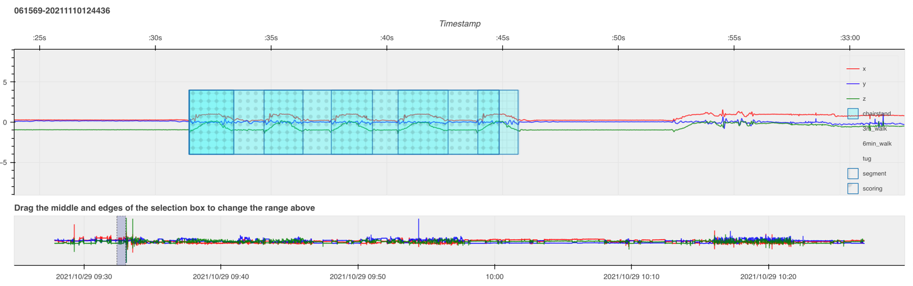

## Workflow

1. **Select your name** in the "Annotate as" picker and open the participant's HDF5 file.
2. **Position the time window** at the start of the file. For most tests the relevant signal lives in the first hour; for the 6MWT you'll need to navigate by time using the activity log.
3. **Box-select the episode** by left-click-dragging across the disturbance. The box has no fill until you apply the first label.
4. **Click the test button** (`Chairstand`, `TUG`, `3m Walk`, `6min Walk`). The annotation becomes a colored overlay.
5. **Add score and segment annotations** by box-selecting the relevant sub-range and clicking the test button again, then the appropriate flag.
6. **Flag for review** anything ambiguous and write a note explaining the concern.
7. **Click Export** to write annotations to disk. The app does not auto-save.
8. **Delete an annotation** by box-selecting fully around it (check "Selected annotations" lists the right one) and clicking **Delete**, then **Export**.

## Activity types and overlay colors

| Activity | Color | What it measures |
|---|---|---|
| Chair Stand | Cyan | Lower-extremity strength via five sit-to-stand cycles |
| TUG | Yellow | Functional mobility — stand, walk 3 m, turn, walk back, sit |
| 3-Meter Walk | Magenta | Short-distance gait speed |
| 6-Minute Walk | Green | Submaximal aerobic capacity |

## Chair Stand Test

The signal shows five distinct waves where all three axes diverge from the flat baseline, separated by brief returns to baseline. Each wave is one sit-to-stand-to-sit cycle. The large amplitude reflects the thigh rotating roughly 90° between sitting and standing.

### Episode

- **Start:** the first disturbance from flat — *all three axes* diverge.
- **Stop:** the last disturbance before flat returns — *two of the three axes* converge to the same count level.
- **Label:** `Chairstand`.

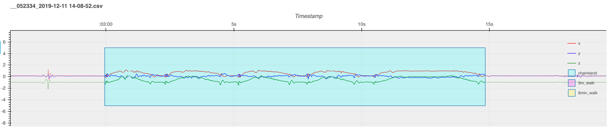

### Score

- **Start:** the first disturbance from flat — all three axes diverge.
- **Stop:** the mid-peak of the **5th** chair-stand wave.
- **Label:** `Chairstand` + **Scoring**.
- The participant must have completed at least 5 chair stands to be scored. If fewer than 5 are completed, skip the score. If more than 5, score the first 5.

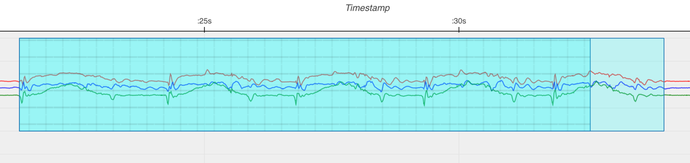

### Segments

Annotate every chair stand, even past 5.

- **Start:** the rise of each chair stand — all three axes diverge.
- **Stop:** the end of the sit — two of the three axes converge.
- **Label:** `Chairstand` + **Segment**.

### Common issues

- **Fewer than 5 chair stands.** Annotate the episode and each segment, but do not score.
- **More than 5 chair stands.** Episode covers all attempts; score the first 5 only; segments cover every attempted stand.
- **Multiple 5-rep attempts.** One episode covers everything. Add a separate score per attempt and a separate segment per stand.

## 3-Meter Usual Walk

After the initial stand, look for this sequence: ~5 s flat → walk 1 (3–25 s of steps) → flat → short step (turnaround) → flat → walk 2 → ~5 s flat.

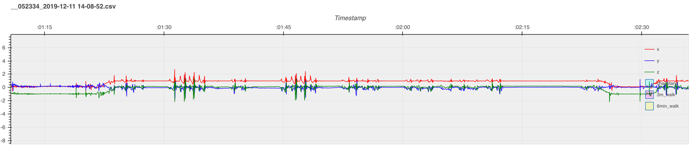

### Episode

- **Start:** the inflection from rest to the first motion on *any* axis, before walk 1.
- **Stop:** the inflection from the last motion on *any* axis at the end of walk 2 back to flat.
- **Label:** `3m Walk`.

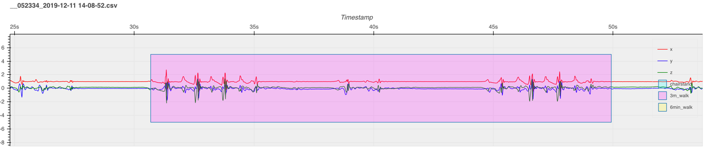

### Score

Each walk has alternating dominant and non-dominant strides. Each step typically shows two "M"-shaped movements along one axis; amplitude differences tell you which is which. Zoom in for clarity.

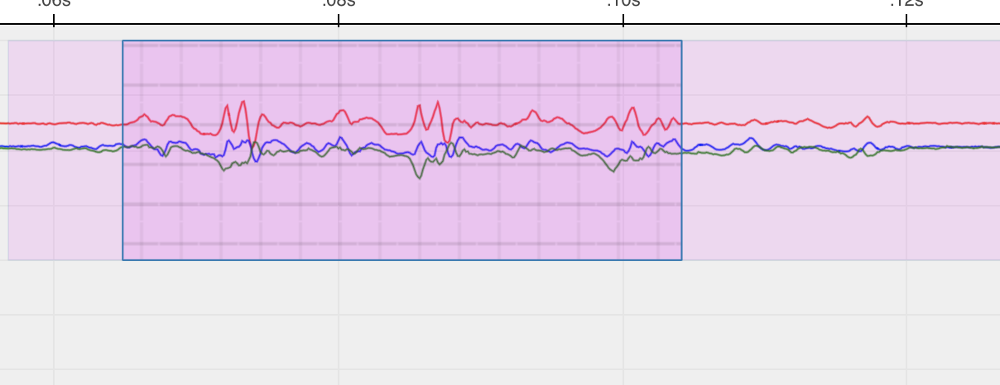

- **Start:** the inflection from rest to the **first full-swing** step on all three axes.
- **Stop:** the *base* of the **final full-swing** step. A full-swing step has amplitude similar to the prior steps (>50 % of their height). A half-amplitude step is not a full swing.
- The X and Z axes diverge in opposite directions on each stride and return to baseline (Z hits 0) at the stride's end.
- **Label:** `3m Walk` + **Scoring**.

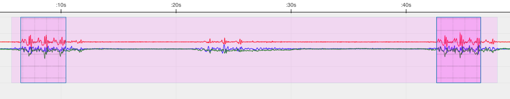

### Segments

None. The 3 m walk doesn't use segment annotations.

### Common issues

- **More than 2 walks.** Include all attempts in the episode. Score each individual walk.
- **No pause before turnaround.** When the turn flows directly into the next walk, use stride pattern and count to identify the boundary — each walk should have a similar number of strides.

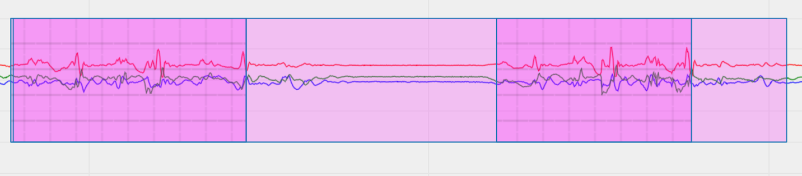

## Timed Up and Go (TUG)

A composite test: chair rise (one large burst) → walk out (regular oscillations) → turn (brief disrupted rhythm with reduced amplitude) → walk back → chair sit (another large burst).

### Episode

- **Start:** the first disturbance from flat — all three axes diverge.
- **Stop:** the last disturbance before flat returns — two of three axes converge.
- **Label:** `TUG`.

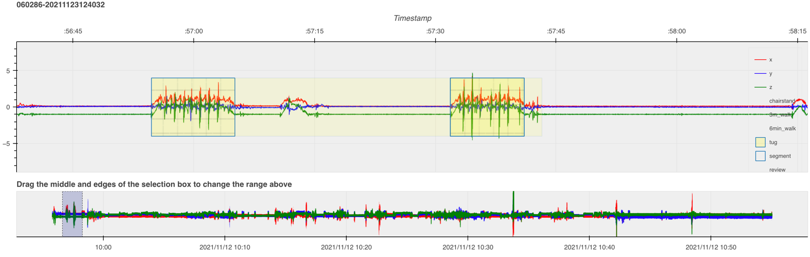

### Score

- **Start:** the first disturbance — all three axes diverge.
- **Stop:** the end of the chair sit — two of three axes converge.
- **Label:** `TUG` + **Scoring**.

(The score and episode often share start/stop points for TUG; the score formalizes the timed portion.)

### Segment

Mark the walking portion only — exclude the chair rise and chair sit.

- **Start:** the first step after rising. The top axis (usually red, when the device is placed correctly) is the clearest reference.
- **Stop:** immediately after the last step, before the descent into the chair.
- **Label:** `TUG` + **Segment**.

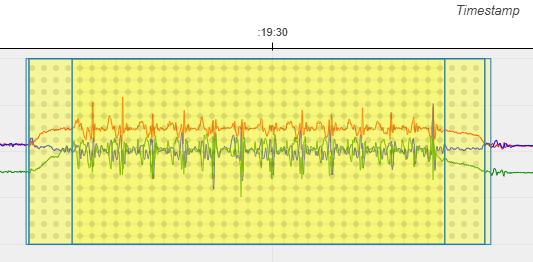

### Common issues

- **More than one TUG attempt.** Single episode covers everything; one score per attempt.
- **Pauses mid-TUG.** Episode and score follow the standard rules. For segments, split the walking portion into two segments if the pause falls mid-walk; otherwise use one segment that excludes the pause.

## 6-Minute Walk Test

The 6MWT has a distinctive boundary marker: participants do a "hand wave" before and after the walk. The wave shows up as a clean sinusoidal pattern in the north-south direction. The walk itself is sustained rhythmic stepping for around 6 minutes; participants may walk slightly more or less.

### Finding the 6MWT in the recording

1. Look up the date and time of the test in the sleep/activity log (cross-reference by `su_id` and device serial).
2. Position the time window at the start of that day.
3. Set windowsize to **14400** (4-hour frames) and step through with **Next**.
4. Look for the sinusoidal hand-wave pattern that brackets the walk.

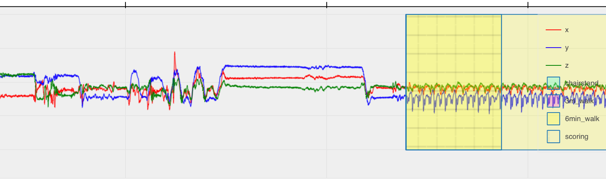

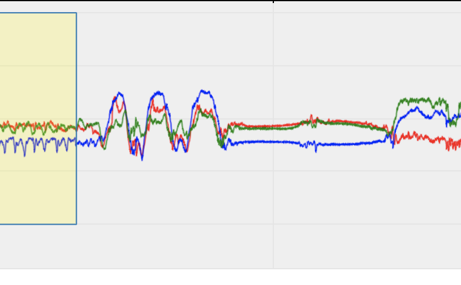

### Episode

The walking pattern between the two hand waves shows rapid, repeated arm-swing waves.

- **Start:** the first repeated rapid arm-swing wave (just after the opening hand wave).
- **Stop:** the end of the walking pattern, just before the closing hand wave.
- **Label:** `6min Walk`.
- Device rotation on the wrist can shift which axes show the pattern.

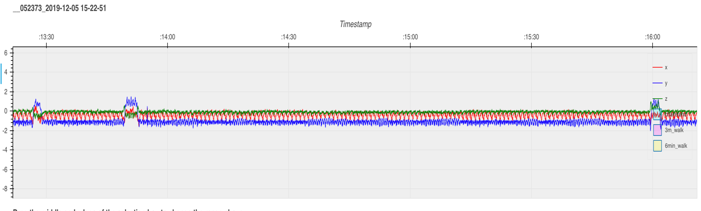

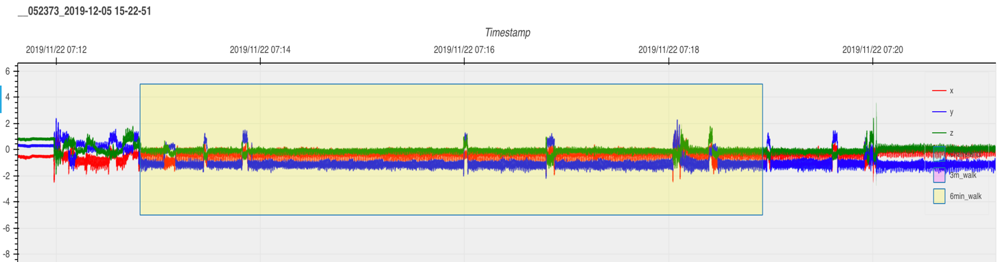

### Score (10-second segment)

Pick any clean 10-second stretch of continuous walking with no breaks, pauses, turns, or device rotation if possible.

- **Start:** any point near the beginning of a clean walk stretch.
- **Stop:** ≥ 10 s later, still in the clean walk.
- **Label:** `6min Walk` + **Scoring**.
- Longer than 10 s is fine.

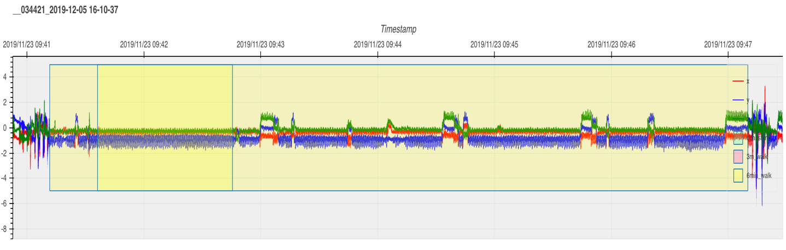

### Segments

None. The 6MWT doesn't use segment annotations.

## Vector magnitude overlay

The plot can show a fourth trace, vector magnitude (VM = √(x² + y² + z²)), as a black line. VM is orientation-independent. Rotating the sensor doesn't change it, so periodic motion shows up as a clean oscillation around 1 g and impacts show up as sharp spikes. Toggle it on or off by clicking **VM** in the plot's legend.

VM is useful for:

- Spotting where activity starts and ends without having to fuse three axes by eye.
- Counting reps. Each sit-to-stand bump or footfall is one VM peak.
- Sanity checks. A long flat near 1 g means the device sat still; a flat near 0 g means a sensor fault or data gap.

## Automated walking detection

The **Walking detection** panel in the sidebar runs a sustained-harmonic-walking detector (based on Urbanek et al. 2015) on the whole file. Candidates appear as dashed orange overlays on the plot. They are suggestions, not labels.

- Click **Detect walking** to scan the file. Results are saved to `data/output/walking_suggestions.xlsx` and survive page refresh.
- The list under the button shows every candidate with time, duration, and step frequency. Click a row to jump the time window to that segment.
- Click the **✕** next to a row to dismiss it. Dismissed rows turn red, leave the plot overlay, and get flagged `deleted=True` in the xlsx. Clicking ✕ again reinstates them.
- To convert a suggestion into a real annotation, box-select over the highlighted region and click `3m Walk` or `6min Walk` as you would for any manual annotation.
- **Clear** hides the current session's list and overlay without touching the xlsx.

## Annotation export format

Annotations are written to `data/output/annotations_<username>.xlsx` on click of **Export**. One row per annotation:

| Column | Type | Description |
|---|---|---|
| `fname` | string | Source HDF5 filename |
| `artifact` | string | Activity type (`chair_stand`, `tug`, `3m_walk`, `6min_walk`) |
| `segment` | bool | Segment flag |
| `scoring` | bool | Scoring flag |
| `review` | bool | Review flag |
| `start_epoch` | float | Start time as Unix epoch (seconds) |
| `end_epoch` | float | End time |
| `start_time` | string | Start time formatted as text |
| `end_time` | string | End time formatted as text |
| `annotated_at` | string | When this row was written |
| `user` | string | Annotator username |
| `notes` | string | Free-text note |

Walking-detection results are written to `data/output/walking_suggestions.xlsx` (shared across users; one row per detected segment, with a `deleted` column for dismissals).

## Tips

- Start with a wide window (e.g. 3600 s) to find episodes, then zoom in to annotate.
- Use the range-selector minimap to scrub long recordings.
- Annotate one test type across the whole file before moving to the next — keeps your eye calibrated.
- Export often. Closing the tab without exporting loses your work.
- When you're not sure, flag for review and move on. A flag is faster and more reliable than a guess.
