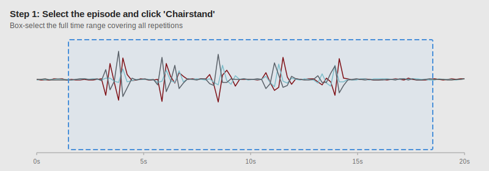
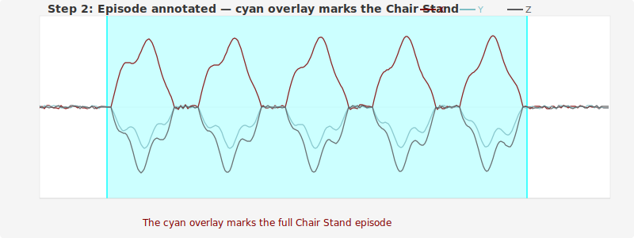
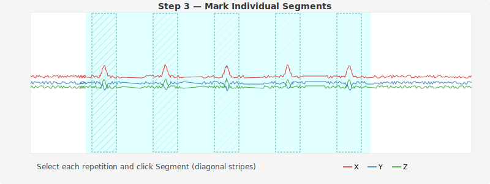
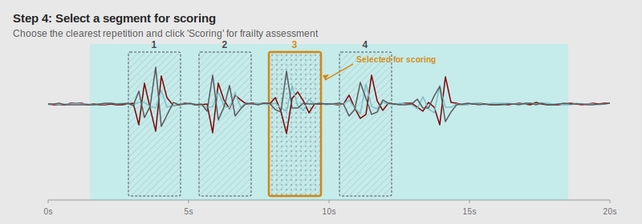

# Annotation Guide

## Overview

Annotations in this tool represent **time boundaries of physical performance test activities** within continuous accelerometry recordings. Each annotation marks when a specific activity (e.g., a Chair Stand Test) began and ended, along with metadata about individual repetitions, scoring selections, and review status.

The goal is to produce a structured dataset that links raw accelerometry signals to clinically meaningful physical performance events for frailty assessment research.

## Activity types and colors

Each activity type is displayed as a colored overlay on the signal plot:

| Activity | Overlay color | Description |
|----------|--------------|-------------|
| **Chair Stand** | Cyan | Repeated sit-to-stand cycles measuring lower-extremity strength |
| **TUG** | Yellow | Timed Up and Go — stand, walk 3 m, turn, walk back, sit |
| **3-Meter Walk** | Magenta | Short-distance gait speed measurement |
| **6-Minute Walk** | Green | Submaximal endurance test — walk as far as possible in 6 minutes |

See [Physical Performance Tests](tests-overview.md) for detailed descriptions of each test, including what the accelerometry signals look like and how to identify them.

## The three flags

After marking an activity episode, annotators use three flags to add structured metadata. Each flag serves a distinct purpose in the annotation workflow.

### Segment

**Visual pattern:** diagonal stripes

The segment flag marks **individual repetitions within an activity episode**. Many physical performance tests consist of multiple discrete movements within a single episode. For example, a Chair Stand Test episode contains five sit-to-stand cycles — each cycle is one segment.

- **Chair Stand**: mark each sit-to-stand-to-sit cycle as a separate segment (typically 5 segments per episode)
- **TUG**: usually a single segment covering the entire movement sequence
- **3-Meter Walk**: one segment per trial (some protocols include multiple trials)
- **6-Minute Walk**: typically one segment for the full walk

### Scoring

**Visual pattern:** dot pattern

The scoring flag marks **which segment the annotator selected for frailty assessment scoring**. After segmenting an episode into individual repetitions, the annotator uses their judgement to pick the one segment that best represents the activity. Only one segment per episode should carry the scoring flag.

Choose the segment where:
- The participant's movement was smooth and clearly executed
- The accelerometry signal is unambiguous
- The participant did not pause, use hands for support, or deviate from the test protocol

### Review

**Visual pattern:** checkerboard

The review flag marks **difficult-to-interpret signals for review by other annotators**. When the accelerometry data is noisy, ambiguous, or the annotator is uncertain about segment boundaries, they should apply the review flag and add a note explaining the concern.

Common reasons to flag for review:
- Overlapping activities that are hard to separate
- Sensor artifacts or signal dropout
- Uncertainty about whether a movement is a test activity or normal daily activity
- Ambiguous segment boundaries (e.g., the participant paused mid-repetition)

Flags are **toggles** — clicking the same flag button again removes it. Multiple flags can coexist on the same annotation (e.g., a segment can be both the scoring selection and flagged for review).

## Annotation boundaries

**Start** the annotation at the **first disturbance from the flat baseline** — the moment the accelerometer axes begin to diverge from their resting values. **End** the annotation at the **last disturbance before the signal returns to flat**. Do not include extended periods of inactivity before or after the actual movement.

## What the signals look like

At rest, the three accelerometer axes (X, Y, Z) converge near a flat baseline. During activity, the axes **diverge** — the amplitude and direction of divergence depend on the type and vigor of movement. Between repetitions, the axes briefly **converge** back to baseline.

### Chair Stand Test

Five distinct waves where all three axes diverge from the flat baseline, separated by brief convergence periods. Each wave corresponds to one sit-to-stand-to-sit cycle. The large deflections reflect the thigh rotating approximately 90° between sitting (horizontal) and standing (vertical).


### Timed Up and Go (TUG)

A composite activity: a chair rise (large single burst like one chair stand), rhythmic walking out (regular oscillations), a turn (brief disrupted rhythm with reduced amplitude), walking back, and a chair sit (another large burst). The walking phases show periodic gait oscillations between the rise and sit bursts.


### 3-Meter Walk

Two walking segments separated by a turnaround. The signal shows: flat baseline → rhythmic gait oscillations (walk out) → brief turn → rhythmic gait oscillations (walk back) → flat baseline. The walk-back segment may show slightly different amplitudes due to dominant vs. non-dominant stride differences.


### 6-Minute Walk Test

Sustained rhythmic walking with periodic brief disruptions from corridor turns. May show subtle fatigue effects (decreasing amplitude) toward the end. Turn points appear as momentary reductions in oscillation amplitude.


## Complete workflow example: Chair Stand Test

This walkthrough covers the full annotation process for a typical Chair Stand Test episode.

### Step 1: Select the episode

Navigate to the portion of the file where the chair stands occur. Box-select from the **first disturbance** (where axes begin to diverge from flat) to the **last disturbance** (where axes return to flat after the final repetition), then click **Chairstand**. Keep the boundaries tight — do not include extended flat periods before or after the activity.



### Step 2: Episode annotated

A cyan overlay appears on the plot, marking the full Chair Stand episode.



### Step 3: Add segment markers

Zoom in so that individual sit-to-stand cycles are clearly visible. For each repetition, box-select the time range and click **Segment**. Diagonal stripe patterns appear on each segment.



### Step 4: Select a segment for scoring

Identify the cleanest, most representative repetition — where the participant's movement was smooth and the signal is unambiguous. Select that segment and click **Scoring**. A dot pattern and gold highlight appear on the chosen segment.



### Step 5: Flag anything unclear

If a repetition has a noisy signal or the participant appears to have paused mid-stand:
- Select that segment
- Click **Review** (checkerboard pattern appears)
- Add a note in the sidebar (e.g., "possible pause at top of stand — unclear if completed")

### Step 6: Add notes and export

Use the **Notes** field in the sidebar to attach free-text context. Click **Save notes** to persist, then click **Export** to save all annotations to disk.

## Annotation export format

Annotations are saved as Excel files in `data/output/`, one file per user, with the naming pattern:

```
data/output/annotations_{username}.xlsx
```

Each row in the file represents one annotation. The columns are:

| Column | Type | Description |
|--------|------|-------------|
| `fname` | string | Source HDF5 filename |
| `artifact` | string | Activity type (e.g., "chairstand", "tug", "3mw", "6mw") |
| `segment` | bool | Whether this annotation is a segment marker |
| `scoring` | bool | Whether this segment was selected for scoring |
| `review` | bool | Whether this annotation is flagged for review |
| `start_epoch` | float | Start time as Unix epoch (seconds) |
| `end_epoch` | float | End time as Unix epoch (seconds) |
| `start_time` | string | Start time as formatted string |
| `end_time` | string | End time as formatted string |
| `annotated_at` | string | Timestamp when the annotation was created |
| `user` | string | Username of the annotator |
| `notes` | string | Free-text notes attached by the annotator |

## Tips for efficient annotation

- **Start with a large window** (e.g., 3600 seconds) to scan for activity episodes, then zoom in to annotate.
- **Use the range selector minimap** to quickly navigate to different parts of the file.
- **Annotate all episodes of one activity type** before moving to the next — this helps maintain consistency.
- **Export frequently** so your work is saved. The app does not auto-save annotations; you must click Export.
- **Use notes liberally** — they help other annotators (and your future self) understand ambiguous decisions.
- **Flag rather than guess** — when in doubt, apply the review flag and move on. It is faster and more reliable than spending time on an uncertain annotation.
