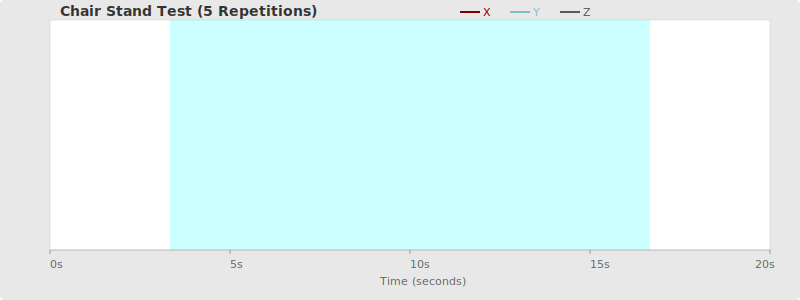
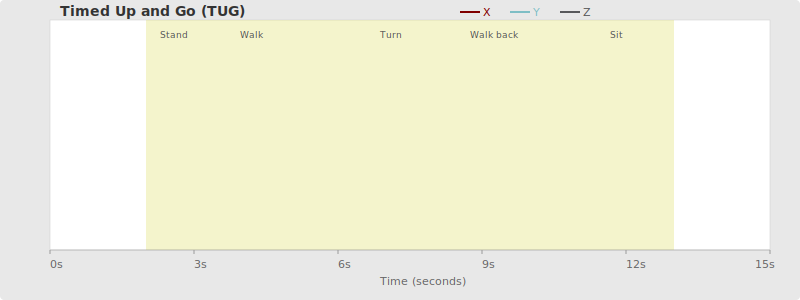
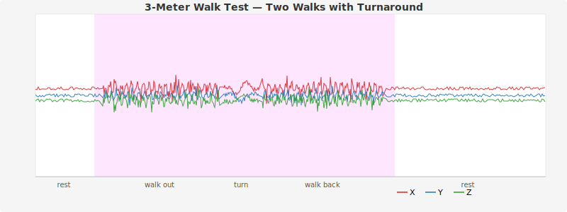
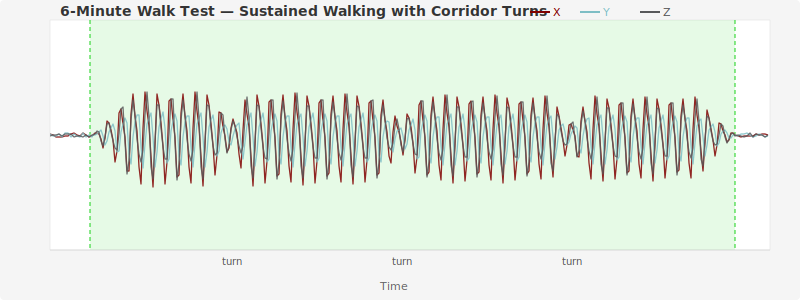

# Physical Performance Tests

The app ships with built-in activity labels for four standardized physical performance tests commonly used in aging and clinical research. These labels serve as the default annotation categories, but the app itself is sensor-agnostic and can visualize accelerometry data from any context.

## Chair Stand Test

The Chair Stand Test measures lower-extremity strength, balance, and postural control. The participant sits in a standard armless chair (approximately 43 cm high) with arms folded across the chest and is timed while standing up and sitting down repeatedly — either 5 times as fast as possible (Five Times Sit-to-Stand) or as many times as possible in 30 seconds (30-Second Chair Stand).

The ability to rise from a seated position is a prerequisite for functional independence, making this test a key indicator of fall risk and physical decline in older adults.

**In accelerometry data**, chair stands produce distinctive periodic spikes as the participant transitions between sitting and standing. Each repetition appears as a high-amplitude burst separated by brief low-amplitude pauses.

**Annotation segments.** The Chair Stand Test is the primary example of an activity with multiple segments. Each individual sit-to-stand-to-sit cycle is one segment. A Five Times Sit-to-Stand episode should contain five segment annotations; a 30-Second Chair Stand episode may contain a variable number depending on the participant's ability. The annotator should mark the full episode as a single Chairstand activity, then create a segment box for each repetition within it.

### References

- Jones, C. J., Rikli, R. E., & Beam, W. C. (1999). A 30-s chair-stand test as a measure of lower body strength in community-residing older adults. *Research Quarterly for Exercise and Sport*, 70(2), 113–119. [doi:10.1080/02701367.1999.10608028](https://doi.org/10.1080/02701367.1999.10608028)
- Guralnik, J. M., Simonsick, E. M., Ferrucci, L., et al. (1994). A short physical performance battery assessing lower extremity function: Association with self-reported disability and prediction of mortality and nursing home admission. *Journal of Gerontology*, 49(2), M85–M94. [doi:10.1093/geronj/49.2.M85](https://doi.org/10.1093/geronj/49.2.M85)

## Timed Up and Go (TUG)

The TUG test assesses functional mobility, dynamic balance, and fall risk. The participant rises from a seated position, walks 3 meters at a comfortable pace, turns around, walks back, and sits down again. The entire sequence is timed.

Per CDC STEADI guidelines, an older adult who takes 12 seconds or longer to complete the TUG is considered at increased risk for falling.

**In accelerometry data**, TUG shows a sit-to-stand transition, a walking segment with rhythmic gait patterns, a turn (brief deceleration/acceleration), another walking segment, and a stand-to-sit transition.

**Annotation segments.** The TUG is performed as a single continuous movement, so it typically has only one segment covering the entire episode. The segment and scoring flags can both be applied to this single segment.

### References

- Podsiadlo, D., & Richardson, S. (1991). The Timed "Up & Go": A test of basic functional mobility for frail elderly persons. *Journal of the American Geriatrics Society*, 39(2), 142–148. [doi:10.1111/j.1532-5415.1991.tb01616.x](https://doi.org/10.1111/j.1532-5415.1991.tb01616.x)
- Shumway-Cook, A., Brauer, S., & Woollacott, M. (2000). Predicting the probability for falls in community-dwelling older adults using the Timed Up & Go test. *Physical Therapy*, 80(9), 896–903. [doi:10.1093/ptj/80.9.896](https://doi.org/10.1093/ptj/80.9.896)
- CDC STEADI — Stopping Elderly Accidents, Deaths & Injuries. [https://www.cdc.gov/steadi/](https://www.cdc.gov/steadi/)

## 3-Meter Walk Test

The 3-Meter Walk Test measures gait speed over a short distance as an indicator of mobility and physical function. The participant walks 3 meters at their usual pace while being timed. Gait speed (meters/second) is calculated from the result.

It is commonly used when space is limited (e.g., home-based assessments) and serves as a practical alternative to longer walk tests. Gait speed is widely regarded as "the sixth vital sign" due to its ability to predict mortality, disability, and hospitalization in older adults.

**In accelerometry data**, the 3-meter walk produces a short burst of rhythmic tri-axial oscillations corresponding to gait cycles.

**Annotation segments.** The 3-Meter Walk is typically annotated as a single segment covering the full walk. In some protocols the participant may perform multiple trials; in that case, each trial is a separate segment within the activity episode, and the annotator selects the most representative trial for scoring.

### References

- Studenski, S., Perera, S., Patel, K., et al. (2011). Gait speed and survival in older adults. *JAMA*, 305(1), 50–58. [doi:10.1001/jama.2010.1923](https://doi.org/10.1001/jama.2010.1923)
- Fritz, S., & Lusardi, M. (2009). White paper: "Walking speed: The sixth vital sign." *Journal of Geriatric Physical Therapy*, 32(2), 46–49. [doi:10.1519/00139143-200932020-00002](https://doi.org/10.1519/00139143-200932020-00002)
- Peel, N. M., Kuys, S. S., & Klein, K. (2013). Gait speed as a measure in geriatric assessment in clinical settings: A systematic review. *The Journals of Gerontology: Series A*, 68(1), 39–46. [doi:10.1093/gerona/gls174](https://doi.org/10.1093/gerona/gls174)

## 6-Minute Walk Test (6MWT)

The 6-Minute Walk Test is a submaximal exercise test that measures aerobic capacity and endurance. The participant walks as far as possible along a flat corridor for 6 minutes at a self-selected pace. The primary outcome is the total distance covered.

It is widely used in clinical and research settings to evaluate patients with cardiac and pulmonary conditions (e.g., heart failure, COPD) and does not require specialized equipment.

**In accelerometry data**, the 6MWT appears as a sustained period (up to 6 minutes) of rhythmic gait-pattern oscillations, often with gradual changes in amplitude or frequency as fatigue sets in. Brief disruptions in the pattern indicate corridor turns.

**Annotation segments.** The 6MWT is generally annotated as a single segment for the entire walk. If the participant takes rest breaks or the protocol involves turn-arounds at corridor ends, annotators may optionally mark start/stop or turn segments, but this is not required. A single segment with the scoring flag is sufficient for most use cases.

### References

- ATS Committee on Proficiency Standards for Clinical Pulmonary Function Laboratories. (2002). ATS statement: Guidelines for the six-minute walk test. *American Journal of Respiratory and Critical Care Medicine*, 166(1), 111–117. [doi:10.1164/ajrccm.166.1.at1102](https://doi.org/10.1164/ajrccm.166.1.at1102)
- Enright, P. L. (2003). The six-minute walk test. *Respiratory Care*, 48(8), 783–785. [PMID: 12890299](https://pubmed.ncbi.nlm.nih.gov/12890299/)
- Bohannon, R. W., & Crouch, R. (2017). Minimal clinically important difference for change in 6-minute walk test distance of adults with pathology: A systematic review. *Journal of Evaluation in Clinical Practice*, 23(2), 377–381. [doi:10.1111/jep.12629](https://doi.org/10.1111/jep.12629)

## Context: NSHAP Study

These physical performance tests are part of the **National Social Life, Health, and Aging Project (NSHAP)**, a longitudinal study of health and social factors in older Americans conducted at the University of Chicago. Accelerometry data is collected during in-home assessments to objectively measure physical activity and functional performance.

### References

- Suzman, R. (2009). The National Social Life, Health, and Aging Project: An Introduction. *The Journals of Gerontology Series B: Psychological Sciences and Social Sciences*, 64B(Suppl 1), i5–i11. [doi:10.1093/geronb/gbp078](https://doi.org/10.1093/geronb/gbp078)
- Huisingh-Scheetz, M., Kocherginsky, M., Magett, E., Rush, P., Dale, W., & Waite, L. (2016). Relating wrist accelerometry measures to disability in older adults. *Archives of Gerontology and Geriatrics*, 62, 68–74. [doi:10.1016/j.archger.2015.09.004](https://doi.org/10.1016/j.archger.2015.09.004)
