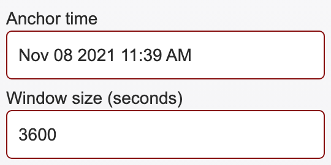
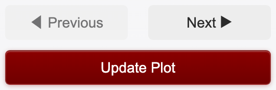
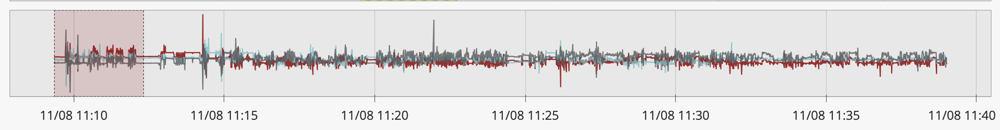
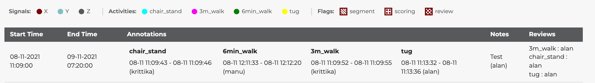
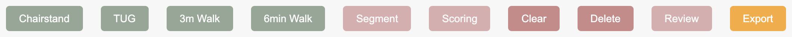
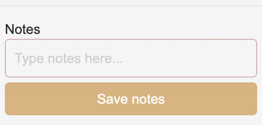
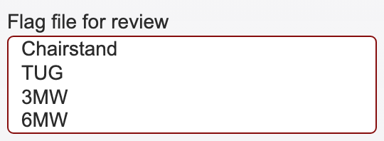
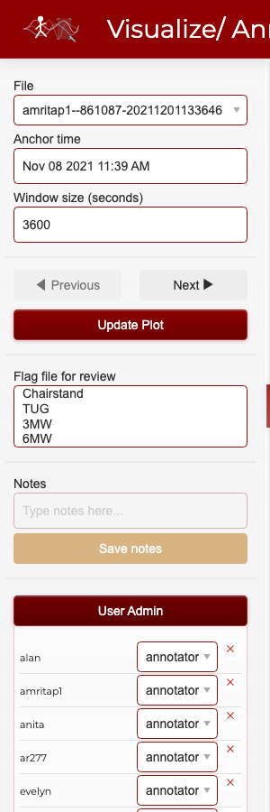

# Usage Guide

## Logging in

Navigate to the app URL and enter your credentials from `credentials.json`.

## Interface overview

The app has three main areas:

- **Sidebar** (left) — File picker, time navigation, window size, review flags, notes, and admin controls
- **Main area** (center) — Signal plot, annotation toolbar, color key, summary, and data tables
- **Header** (top) — App logo, title, network latency indicator, current user, impersonation selector (admins), and logout

### Header bar

The header displays the app logo, title, a **network latency indicator** (round-trip time to the server, updated every 10 seconds), the currently logged-in user, an impersonation dropdown (for admins), and a logout icon on the far right. The latency value is color-coded: teal (<100 ms), orange (<300 ms), or red (≥300 ms).

### Sidebar

The sidebar contains all controls for file selection, time navigation, plot updates, review flags, notes, and user administration (for admins).

---

## Navigating signals

### File selection

Use the **File** dropdown at the top of the sidebar to select a file. Files are deterministically assigned to annotators so each person has a consistent workload. The file name format is `username--participant_id-date`.

### Time controls

The **Anchor time** and **Window size** fields control which portion of the file is displayed.

- **Anchor time** — The center timestamp of the current view. Enter a specific time (format: `Nov 08 2021 11:39 AM`) and click **Update Plot** to jump to that point in the file.
- **Window size (seconds)** — How many seconds of data are shown at once. The default is `3600` (1 hour). Decrease this value to zoom in for finer annotation, or increase it to see broader patterns.

### Previous / Next navigation

The **Previous** and **Next** buttons move the view backward or forward by one full window length.

- **Previous** moves the anchor back by one window. It is automatically **disabled** when you are at the start of the file (you cannot scroll further left).
- **Next** moves the anchor forward by one window. It is automatically **disabled** when you reach the end of the file.
- **Update Plot** re-renders the plot with the current anchor time and window size. Click this after manually editing the anchor time or window size fields.

### Range selector (minimap)

Below the main signal plot is a range selector minimap that shows the entire file at a glance. You can drag a selection window on the minimap to quickly navigate to any part of the file.

The range selector uses fewer data points than the main plot for faster rendering, but still shows the overall signal shape.

---

## Understanding the plot

The signal plot shows tri-axial accelerometry data (x, y, z axes) with colored overlays for annotations and hatch patterns for flags.

### Color key

The color key strip below the toolbar explains what each color and pattern means:

- **Signals** — The three accelerometry axes are shown as colored lines: X (maroon), Y (teal), Z (gray)
- **Activities** — Annotated regions appear as colored overlays: chair stand (cyan), 3m walk (magenta), 6min walk (green), TUG (yellow)
- **Flags** — Overlay patterns indicate flags: diagonal stripes (segment — marks individual repetitions), dots (scoring — the segment selected for frailty scoring), checkerboard (review — flagged for a second opinion)

### Downsampling and performance

Raw accelerometry files can contain **500,000+ data points per axis**. Sending all of them to the browser would make the interface slow and unresponsive. To solve this, the app uses **LTTB (Largest Triangle Three Buckets)** downsampling to reduce each axis to ~10,000 visually representative points.

LTTB is a perceptual downsampling algorithm that preserves the visual shape of the signal — peaks, valleys, and rapid changes are retained while flat regions are compressed. This means the plot looks nearly identical to the full-resolution data, but renders much faster.

- **Main plot**: ~10,000 points per axis
- **Range selector minimap**: ~2,000 points per axis (lower resolution since it is smaller)

If the `lttbc` C extension is installed, downsampling is very fast. Otherwise, the app falls back to uniform strided sampling, which is less accurate but still performant.

The window size also affects how much data is loaded and downsampled. A smaller window (e.g., 60 seconds) shows more detail from fewer raw points, while a larger window (e.g., 3600 seconds) compresses more data into the same number of display points.

When navigating with **Previous** / **Next**, the app uses a fast path that updates the existing plot data in place (no full figure rebuild), so transitions between windows are near-instant.

---

## Making annotations

### Step 1: Select a time range

Click and drag on the main signal plot to box-select a time range. The selected region will be highlighted.

### Step 2: Choose an activity type

The annotation toolbar provides buttons for each activity type:

Click one of the activity buttons to annotate the selected time range:

| Button | Activity | Overlay color |
|--------|----------|---------------|
| **Chairstand** | Chair stand test | Cyan |
| **TUG** | Timed Up and Go | Yellow |
| **3m Walk** | 3-meter walk | Magenta |
| **6min Walk** | 6-minute walk | Green |

The annotation appears immediately as a colored overlay on the plot.

### Step 3: Add flags (optional)

After creating an annotation, you can add flags to provide additional classification. Select a time range that overlaps existing annotations, then click:

| Button | Flag | Visual pattern | Purpose |
|--------|------|---------------|---------|
| **Segment** | Segment marker | Diagonal stripes | Marks an individual repetition within an activity episode |
| **Scoring** | Scoring selection | Dot pattern | Indicates the segment selected for frailty assessment scoring |
| **Review** | Review needed | Checkerboard | Flags the annotation for review by another annotator when the signal is difficult to interpret |

**Segment flag.** Some activities consist of multiple repetitions within a single episode. The segment flag is used to mark each individual repetition. For example, a Chair Stand Test episode may contain five sit-to-stand cycles; each cycle should be marked with its own segment box inside the larger activity annotation. Activities like TUG, which are performed as a single continuous movement, typically have only one segment.

**Scoring flag.** After segmenting an episode into individual repetitions, the annotator uses their judgement to select the one segment that best represents the activity for frailty assessment scoring. Only one segment per episode should carry the scoring flag. The chosen segment should be the most clearly executed and representative repetition — avoid segments where the participant paused, used their hands for support, or where the signal is ambiguous.

**Review flag.** When accelerometry signals are noisy, ambiguous, or otherwise difficult to interpret with confidence, the annotator should apply the review flag and add a note explaining the concern. This flags the annotation for a second opinion from another annotator or admin. Common reasons to flag for review include overlapping activities, sensor artifacts, or uncertainty about segment boundaries.

Flags are **toggles** — clicking the same flag button again removes the flag from the selected annotations. Multiple flags can be applied to the same annotation simultaneously (e.g., a segment can be both the scoring selection and flagged for review if the annotator is unsure).

#### Example workflow: annotating a Chair Stand Test

1. **Mark the full episode.** Box-select the entire time range covering all five chair stands and click **Chairstand** to create the activity annotation.
2. **Segment each repetition.** Zoom in (reduce window size) so individual sit-to-stand cycles are visible. Box-select each cycle and click **Segment**. You should end up with five segment boxes inside the activity overlay.
3. **Select one segment for scoring.** Identify the cleanest, most representative repetition — for example, the third stand where the participant's movement was smooth and the signal is unambiguous. Select that segment and click **Scoring**.
4. **Flag anything unclear.** If one of the repetitions has a noisy signal or the participant appears to have paused mid-stand, select that segment, click **Review**, and add a note (e.g., "possible pause at top of stand — unclear if completed"). Another annotator can then revisit this segment.
5. **Export** when finished.

### Step 4: Add notes (optional)

Type a note in the **Notes** field in the sidebar and click **Save notes** to attach it to the currently selected annotations.

Notes are free-text and can contain any context about the annotation (e.g., "uncertain boundary", "possible artifact", "participant paused mid-walk").

### Step 5: Export

Click **Export** in the toolbar to save all annotations for the current user and file to disk. Annotations are stored as Excel files in `visualize_accelerometry/data/output/` with the naming pattern `annotations_username.xlsx`.

### Other toolbar actions

- **Clear** — Clears the current box selection without modifying any annotations
- **Delete** — Permanently removes the selected annotations
- **Review** — Toggles the review flag (same as the flag button described above)

---

## File-level review flags

The **Flag file for review** multi-select in the sidebar lets you mark entire activity types as needing review at the file level, independent of individual annotations.

Select one or more activity types (Chairstand, TUG, 3MW, 6MW) to flag them. This is useful when:

- You are unsure about all annotations of a certain type in the file
- You want to indicate that a particular activity was not found in the file
- You need another annotator to double-check specific activity types

These file-level flags are saved alongside annotations when you click **Export**.

---

## Logging out

Click the logout icon (arrow) in the top-right corner of the header. You will see a branded logout confirmation page with an option to log in again.

---

## Admin features

Users listed in `ADMIN_USERS` (in `config.py`) have access to additional features.

### User administration

Admin users see a **User Admin** panel at the bottom of the sidebar. Click it to expand.

From here you can:

- **View all users** with their current roles (annotator, admin, or both)
- **Change user roles** using the dropdown next to each username
- **Remove users** by clicking the red X button
- **Add new users** by filling in the username, password, and role fields at the bottom

Role changes and user additions take effect immediately and update the shared `credentials.json` file.

### Impersonation

The **Impersonate as** dropdown in the header allows admin users to temporarily act as another user. This is useful for:

- **Reviewing another annotator's work** — see their annotations on the plot
- **Annotating on someone's behalf** — any annotations you create while impersonating are saved under that user's name
- **Troubleshooting** — see exactly what another user sees

To impersonate, select a username from the dropdown. The header updates to show who you are impersonating:

While impersonating:
- The plot shows the impersonated user's annotations
- New annotations are saved under the impersonated user's name
- The dropdown shows **"Stop impersonating"** as the first option

To stop impersonating, select **"Stop impersonating"** from the dropdown. You return to your own identity and annotations.
