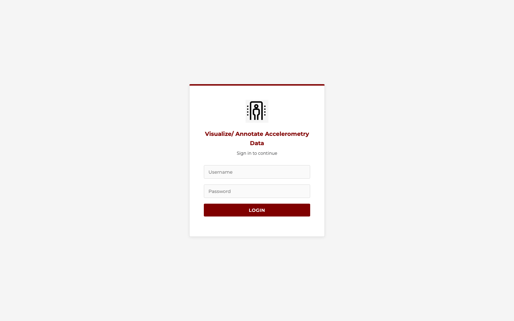
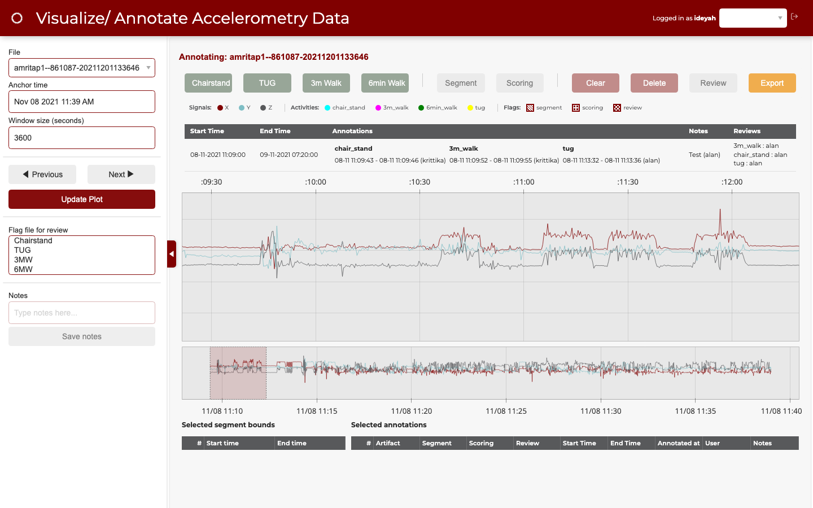
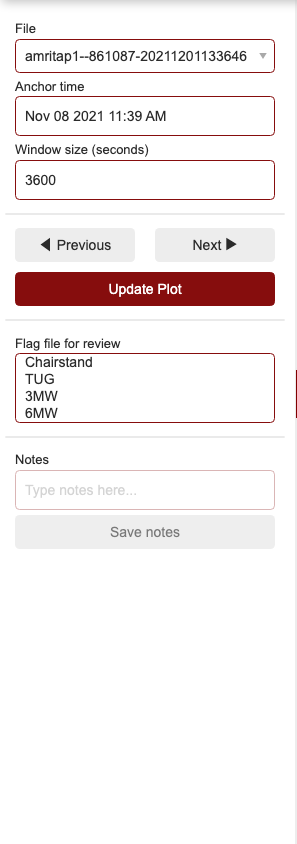
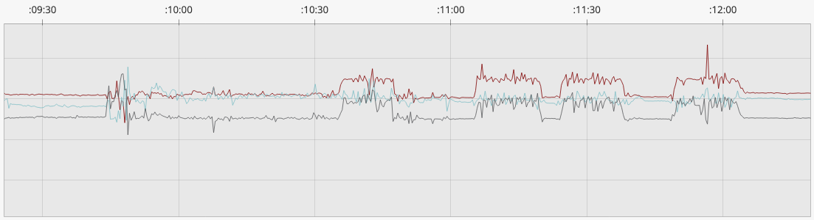
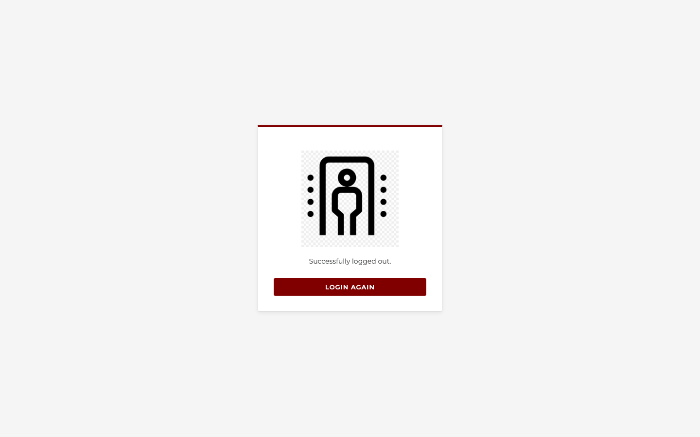

# Usage Guide

## Logging in

Navigate to the app URL and enter your credentials from `credentials.json`.

## Interface overview

The app has three main areas:

- **Sidebar** (left) — File picker, time navigation, window size, review flags, and notes
- **Main area** (center) — Signal plot, annotation toolbar, summary table, and data tables
- **Header** (top) — Username display, impersonation selector (admins), and logout

### Header bar

The header displays the app title, current user, impersonation selector (for admins), and a logout icon on the far right.

### Sidebar

The sidebar contains file selection, time navigation, review flags, and notes.

## Navigating signals

### File selection

Use the **File** dropdown in the sidebar to select a file. Files are deterministically assigned to annotators so each person has a consistent workload.

### Time navigation

- **Previous / Next** buttons move the view by one full window
- **Anchor time** field lets you jump to a specific timestamp (format: `Jun 1 2005 1:33 PM`)
- **Window size** controls how many seconds of data are shown at once (default: 3600s = 1 hour)
- **Range selector** (minimap below the plot) lets you drag a window across the entire file

### Understanding the plot

The signal plot shows tri-axial accelerometry data (x, y, z) with colored overlays for annotations and hatch patterns for flags.

- **Colored lines** show the three accelerometry axes (x, y, z)
- **Colored overlays** show existing annotations (cyan = chair stand, magenta = 3m walk, green = 6min walk, yellow = TUG)
- **Hatch patterns** show flags (cross = segment, dots = scoring, spiral = review)

## Making annotations

1. **Select a time range** by click-dragging on the plot (box select)
2. Click one of the annotation buttons: **Chairstand**, **TUG**, **3m Walk**, or **6min Walk**
3. The annotation appears as a colored overlay on the plot
4. Click **Export** to save annotations to disk

### Modifying annotations

With a time range selected that contains existing annotations:

- **Segment** / **Scoring** / **Review** — Toggle flags on the selected annotations
- **Delete** — Remove the selected annotations
- **Save notes** — Attach the text from the Notes field to the selected annotations
- **Clear** — Clear the current selection without making changes

## File-level review flags

Use the **Flag file for review** multi-select in the sidebar to mark entire activity types as reviewed. These flags persist independently of time-range annotations.

## Saving work

Click **Export** in the annotation toolbar to save all annotations for the current user and file to an Excel file in `visualize_accelerometry/data/output/`.

Annotations are stored per-user: `annotations_username.xlsx`.

## Logging out

Click the logout icon in the top-right corner of the header. You will see a branded logout confirmation page.

## Admin features

Users listed in `ADMIN_USERS` (in `config.py`) see an additional **User Admin** panel in the sidebar:

- **Add/remove users** and set their roles (annotator, admin, or both)
- **Impersonate** other users via the header dropdown to view their annotations or annotate on their behalf
- **Stop impersonating** returns to your own identity
