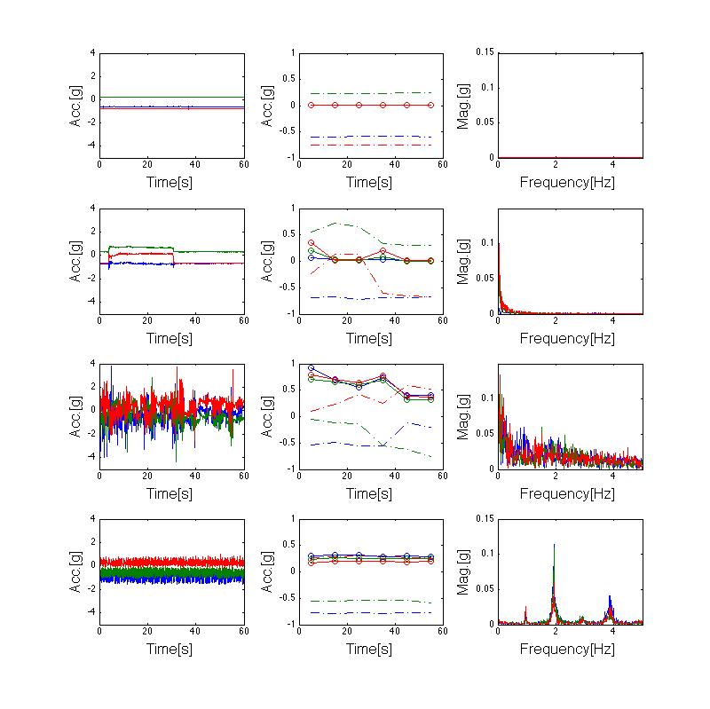

# Usage Guide

## Logging in

Navigate to the app URL and enter your credentials from `credentials.json`.

## Interface overview

The app has three main areas:

- **Sidebar** (left) — File picker, time navigation, window size, review flags, notes, and admin controls
- **Main area** (center) — Signal plot, annotation toolbar, color key, summary, and data tables
- **Header** (top) — App logo, title, network latency indicator, current user, impersonation selector (admins), and logout

### Header bar

The header shows the app logo, title, a network latency indicator (round-trip time to the server, updated every 10 seconds), the current user, an impersonation dropdown for admins, and a logout icon on the right. Latency is color-coded: teal (<100 ms), orange (<300 ms), red (≥300 ms).

### Sidebar

The sidebar contains all controls for file selection, time navigation, plot updates, review flags, notes, and user administration (for admins).

---

## Navigating signals

### File selection

Pick a file from the **File** dropdown at the top of the sidebar. Files are assigned deterministically so each annotator sees a consistent workload. The file name format is `username--participant_id-date`.

### Time controls

The **Anchor time** and **Window size** fields control which portion of the file is displayed.

- **Anchor time** — The center timestamp of the current view. Enter a specific time (format: `Nov 08 2021 11:39 AM`) and click **Update Plot** to jump to that point in the file.
- **Window size (seconds)** — How many seconds of data are shown at once. The default is `3600` (1 hour). Decrease this value to zoom in for finer annotation, or increase it to see broader patterns.

### Previous / Next navigation

The **Previous** and **Next** buttons move the view backward or forward by one full window length.

- **Previous** moves the anchor back by one window. It is automatically **disabled** when you are at the start of the file (you cannot scroll further left).
- **Next** moves the anchor forward by one window. It is automatically **disabled** when you reach the end of the file.
- **Update Plot** re-renders the plot with the current anchor time and window size. Click this after manually editing the anchor time or window size fields.

### Range selector (minimap)

Below the main signal plot is a range selector minimap that shows the entire file at a glance. You can drag a selection window on the minimap to quickly navigate to any part of the file.

The range selector uses fewer data points than the main plot for faster rendering, but still shows the overall signal shape.

---

## Understanding the plot

The signal plot shows tri-axial accelerometry data (x, y, z axes) with colored overlays for annotations and hatch patterns for flags.

### Color key

The color key strip below the toolbar explains what each color and pattern means:

- **Signals** — The three accelerometry axes are shown as colored lines: X (maroon), Y (teal), Z (gray)
- **Activities** — Annotated regions appear as colored overlays: chair stand (cyan), 3m walk (magenta), 6min walk (green), TUG (yellow)
- **Flags** — Overlay patterns indicate flags: diagonal stripes (segment — marks individual repetitions), dots (scoring — the segment selected for frailty scoring), checkerboard (review — flagged for a second opinion)

### Downsampling and performance

Raw files can hold 500,000+ points per axis. Sending them all to the browser would be slow. The app uses **LTTB (Largest Triangle Three Buckets)** downsampling to cut each axis down to ~10,000 representative points.

LTTB keeps the visual shape of the signal: peaks, valleys, and rapid changes stay; flat regions compress. The plot looks nearly identical to full-resolution data and renders much faster.

- **Main plot:** ~10,000 points per axis
- **Range selector minimap:** ~2,000 points per axis

The `lttbc` C extension makes downsampling fast. Without it, the app falls back to uniform strided sampling, which is less accurate but still quick.

Window size affects how much raw data is loaded and downsampled. A smaller window (e.g. 60 s) shows more detail from fewer raw points; a larger window (e.g. 3600 s) compresses more data into the same display budget.

Previous/Next uses a fast path that patches the existing plot data in place. No full figure rebuild, so transitions between windows are near-instant.

---

## Vector magnitude overlay

The plot can show a fourth trace, **vector magnitude** (VM = √(x² + y² + z²)), as a black line. Toggle it on by clicking **VM** in the plot's legend (top right).

VM is orientation-independent. Rotating the sensor doesn't change the value, so periodic motion shows up as a clean oscillation around 1 g and impacts show up as sharp spikes. It's useful for:

- Spotting where activity starts and ends without having to fuse three axes by eye.
- Counting reps. Each sit-to-stand or footfall is one VM peak.
- Sanity checks. A long flat near 1 g means the device sat still; a flat near 0 g means a sensor fault or data gap.

VM is hidden by default to keep the initial view simple. Clicking **x**, **y**, **z**, or **VM** in the legend toggles each line independently.

---

## Walking detection

The **Walking detection** panel in the sidebar runs an algorithm based on Urbanek et al. 2015 ("sustained harmonic walking") on the whole file. Candidates appear as dashed orange overlays on the plot.

Candidates are suggestions, not annotations. You decide which to keep, dismiss, or convert.

### What the algorithm looks for

Urbanek classifies short windows of accelerometry into four signal types. Walking is the fourth: a locally periodic signal where most of the spectral power lands in a single peak inside the walking band.

*Each row shows a 60-second window. Left: raw tri-axial signal. Middle: rolling mean and standard deviation. Right: Fourier spectrum. From top to bottom: resting (flat signal, no spectral peaks), change in position (mean shift, peak at 0 Hz only), compound activity (busy signal, many unaligned spectral peaks across axes), and walking (clean periodic signal, one dominant peak around 2 Hz with a harmonic at 4 Hz). Figure adapted from [Urbanek et al. 2015](https://arxiv.org/abs/1505.04066).*

What separates walking from the other three:

- The signal is **periodic** (unlike resting or position changes).
- The dominant frequency falls in the **walking band**: 0.5–3 Hz, or 30 to 180 steps per minute.
- Most of the in-band power is concentrated at one peak (unlike compound activities, where many frequencies share the spectrum).

### How the detector works

The algorithm operates on the vector-magnitude signal `VM = √(x² + y² + z²)`. VM is used because it does not depend on sensor orientation — rotating the device on the wrist doesn't change it. This matters in free-living data where the sensor can rotate freely.

For each 3-second window (sliding with a 1-second hop):

1. Detrend (subtract the mean — VM sits around 1 g due to gravity).
2. Compute the FFT and restrict to the walking band.
3. Find the dominant peak frequency `f_peak` and its power.
4. Compute **harmonicity** = `peak_power / total_band_power`. High harmonicity means the energy is concentrated at one frequency, which is the signature of clean periodic motion.

Two thresholds with hysteresis then turn the per-window scores into segments:

- A **strict** threshold (harmonicity ≥ 0.5) identifies the core of a walking bout. At least two consecutive strict windows are required to anchor a segment, to filter out single-window false positives.
- A **loose** threshold (harmonicity ≥ 0.4) extends the segment outward from its core through the ramp-up and ramp-down phases. Without this, the algorithm would clip the first and last few seconds of every walking bout, where the cadence is still stabilizing.

After the per-segment pass, segments separated by gaps of three seconds or less get merged, since a tiny dropout inside a longer bout usually reflects a brief cadence change, not a real pause. Finally, segments shorter than 10 seconds get dropped — Urbanek defines "sustained" as ≥10 s of stable cadence.

Each kept segment carries its mean step frequency (averaged across strict windows in the segment). Typical adult walking ranges from 1.5 to 2.5 Hz (90 to 150 steps per minute).

### Reference

Urbanek, J.K., et al. (2015). *Prediction of sustained harmonic walking in the free-living environment using raw accelerometry data.* arXiv:[1505.04066](https://arxiv.org/abs/1505.04066).

### Using it

- Click **Detect walking** to scan the file. Results are saved to `data/output/walking_suggestions.xlsx`.
- The list below the button shows every detected segment with its time, duration, and step frequency. Click a row to jump the time window to that segment.
- Click the **✕** next to a row to dismiss it. Dismissed rows turn red, disappear from the plot overlay, and are flagged `deleted=True` in the xlsx. Clicking ✕ again restores them.
- **Clear** hides the in-memory list and overlay for the current session without modifying the xlsx.

### Persistence

- The xlsx is **shared across users**, since the algorithm output is deterministic per file.
- Results survive page refresh — on load, the app reads back the saved list (minus dismissed entries) for the current file.
- Clicking **Detect walking** again replaces this file's rows in the xlsx with fresh algorithm output. Dismissals are preserved by matching on `(fname, start_epoch, end_epoch)`.

### Converting a suggestion to an annotation

Suggestions stay separate from annotations. To accept one:

1. Box-select over the highlighted region.
2. Click `3m Walk` or `6min Walk` exactly as you would for any manual annotation.

The dashed orange box is just a visual hint; nothing is auto-labeled.

---

## Making annotations

### Step 1: Select a time range

Click and drag on the main signal plot to box-select a time range. The selected region will be highlighted.

### Step 2: Choose an activity type

The annotation toolbar provides buttons for each activity type:

Click one of the activity buttons to annotate the selected time range:

| Button | Activity | Overlay color |
|--------|----------|---------------|
| **Chairstand** | Chair stand test | Cyan |
| **TUG** | Timed Up and Go | Yellow |
| **3m Walk** | 3-meter walk | Magenta |
| **6min Walk** | 6-minute walk | Green |

The annotation appears immediately as a colored overlay on the plot.

### Step 3: Add flags (optional)

After creating an annotation, you can add flags to provide additional classification. Select a time range that overlaps existing annotations, then click:

| Button | Flag | Visual pattern | Purpose |
|--------|------|---------------|---------|
| **Segment** | Segment marker | Diagonal stripes | Marks an individual repetition within an activity episode |
| **Scoring** | Scoring selection | Dot pattern | Indicates the segment selected for frailty assessment scoring |
| **Review** | Review needed | Checkerboard | Flags the annotation for review by another annotator when the signal is difficult to interpret |

**Segment flag.** Some activities have multiple reps within one episode. The segment flag marks each rep. For example, a Chair Stand Test episode may contain five sit-to-stand cycles, and each cycle gets its own segment box inside the activity annotation. TUG is a single continuous movement, so it usually has just one segment.

**Scoring flag.** Once an episode is split into reps, the annotator picks the segment that best represents the activity for scoring. Only one segment per episode should carry the scoring flag. Pick the cleanest, most representative rep. Avoid segments where the participant paused, used hands for support, or where the signal is ambiguous.

**Review flag.** When a signal is noisy or ambiguous, apply the review flag and add a note explaining the concern. This sends the annotation to another annotator or admin for a second opinion. Common reasons: overlapping activities, sensor artifacts, or uncertain segment boundaries.

Flags are toggles. Clicking the same flag button again removes it. Multiple flags can sit on the same annotation (e.g., a segment can be both the scoring selection and flagged for review if you're unsure).

#### Example workflow: annotating a Chair Stand Test

1. **Mark the full episode.** Box-select the entire time range covering all five chair stands and click **Chairstand** to create the activity annotation.
2. **Segment each repetition.** Zoom in (reduce window size) so individual sit-to-stand cycles are visible. Box-select each cycle and click **Segment**. You should end up with five segment boxes inside the activity overlay.
3. **Select one segment for scoring.** Identify the cleanest, most representative repetition — for example, the third stand where the participant's movement was smooth and the signal is unambiguous. Select that segment and click **Scoring**.
4. **Flag anything unclear.** If one of the repetitions has a noisy signal or the participant appears to have paused mid-stand, select that segment, click **Review**, and add a note (e.g., "possible pause at top of stand — unclear if completed"). Another annotator can then revisit this segment.
5. **Export** when finished.

### Step 4: Add notes (optional)

Type a note in the **Notes** field in the sidebar and click **Save notes** to attach it to the currently selected annotations.

Notes are free-text and can contain any context about the annotation (e.g., "uncertain boundary", "possible artifact", "participant paused mid-walk").

### Step 5: Export

Click **Export** in the toolbar to save all annotations for the current user and file to disk. Annotations are stored as Excel files in `visualize_accelerometry/data/output/` with the naming pattern `annotations_username.xlsx`.

### Other toolbar actions

- **Clear** — Clears the current box selection without modifying any annotations
- **Delete** — Permanently removes the selected annotations
- **Review** — Toggles the review flag (same as the flag button described above)

---

## File-level review flags

The **Flag file for review** multi-select in the sidebar lets you mark entire activity types as needing review at the file level, independent of individual annotations.

Select one or more activity types (Chairstand, TUG, 3MW, 6MW) to flag them. This is useful when:

- You are unsure about all annotations of a certain type in the file
- You want to indicate that a particular activity was not found in the file
- You need another annotator to double-check specific activity types

These file-level flags are saved alongside annotations when you click **Export**.

---

## Logging out

Click the logout icon (arrow) in the top-right corner of the header. You will see a branded logout confirmation page with an option to log in again.

---

## Admin features

Users listed in `ADMIN_USERS` (in `config.py`) have access to additional features.

### User administration

Admin users see a **User Admin** panel at the bottom of the sidebar. Click it to expand.

From here you can:

- **View all users** with their current roles (annotator, admin, or both)
- **Change user roles** using the dropdown next to each username
- **Remove users** by clicking the red X button
- **Add new users** by filling in the username, password, and role fields at the bottom

Role changes and user additions take effect immediately and update the shared `credentials.json` file.

### Impersonation

The **Impersonate as** dropdown in the header allows admin users to temporarily act as another user. This is useful for:

- **Reviewing another annotator's work** — see their annotations on the plot
- **Annotating on someone's behalf** — any annotations you create while impersonating are saved under that user's name
- **Troubleshooting** — see exactly what another user sees

To impersonate, select a username from the dropdown. The header updates to show who you are impersonating:

While impersonating:
- The plot shows the impersonated user's annotations
- New annotations are saved under the impersonated user's name
- The dropdown shows **"Stop impersonating"** as the first option

To stop impersonating, select **"Stop impersonating"** from the dropdown. You return to your own identity and annotations.
